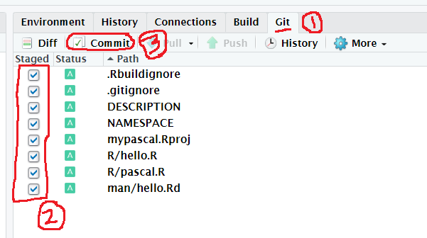

---
jupyter:
  jupytext:
    formats: ipynb,Rmd
    text_representation:
      extension: .Rmd
      format_name: rmarkdown
      format_version: '1.2'
      jupytext_version: 1.4.2
  kernelspec:
    display_name: R 3.6
    language: R
    name: ir
---

## Midterm project : your first R package

This document explain how to build your own R package and distribute via Github.

### Prerequisite

* What is R package?  
  * https://r-pkgs.org/intro.html

* What is Github?
  * https://r-pkgs.org/git.html

* Github account  
  * Go to the Github site and sign up.
  * https://github.com
  
* Think about what R package to create.


### Server or your PC

* You can use ksublee.dev:8787 Rstudio server or your own Rstudo in your computer.  
* However, to use your PC and Rstudio, you should install relevant packages, such as devtools and git.
* This document is based on ksublee.dev:8787 where I already installed necessary tools.


### Create R project 

* First, connect to https://ksublee.dev:8787.
* File -> New Project


* New Directory.


* Select R package.


* Give an appropriate package name and check 'Create a git repository'.
  * My package name is 'mypascal', but yours should be different one.
* Click 'Create Project'.


* Now you can see automatically generated default package.
* In 'R' directory, your source code will be placed.


<!-- #region -->
### Write code and save


* Open an empty script file and write some functions for your package.
* Your code shoud have the following form with comments.
  * Instead of ***Title of function***, write the title of your function.
  * Instead of ***Description of function***, write the description of your function.
  * Under ```@examples```, write an example code based on your function.
  * Your function do not have to be named as ```yourfunction```. use an appropriate name.
<!-- #endregion -->

```{r}
#' Title of function
#'
#' Description of function
#'
#' @examples
#'
#' yourfunction()
yourfunction <- function() {
  # do something important thing
  
}
```

* Save source code in R directory.
  * You can use any name for the file.
  * My code is based on http://rosettacode.org/wiki/Pascal%27s_triangle#R
  


### Make document and check package

* In R console, run ```devtools::document()```.
  * This function makes document based on comments you created in the previous section.
  


* In Build tab in the right upper section in R studio, you can check the validity of your package.


* You should have no error, if you have, then fix it and rerun check.


### Git commit

* In the right upper section of Rstudio, you see Git tab.

* Add updated file and commit in the following order.



* If you ecounter an error as in the following:


* then, in Terminal, run following command:

  * ```git config user.name "yourname"```
  
  * Type your name instead of ***yourname*** but any name would be ok.
  
    * Of course, you can add your email similarly.
  


* Now you can see a window for commit message. Write a summary of what you have done.


### Create Github repository

* Now go to : https://github.com
* Create empty github repository.


* The repository name should be same with your R package name.
  * Instead of ***your_repo_name***, use your R package name.


* If an empty repository is created, then copy the url.
  * It has the form ```https://github.com/username/reponame.git```


### Push to Github

* Now go back to Rsutdio.
* Open Termial and add git remote repository with the following step.
  * ```cd mypascal``` impiles move to your working directory of R package.
  * Therefore, you should use your R package name instead of ***mypascal***.
  * In ```git remote add origin https://github.com/ksublee/mypascal.git```, you should use your url that you copied  from your new Github repo.
  * ```git push origin master```
  * You should use your Github username and password.


* You might encounter errors saying ```cannot run rpostbak=askpass ... ```, but it seems not a big deal.
* Check your Github repo changed.


### Install your package from Github

* First close your project from Rstudio.


* Open an empty Rscript and run the following code.  
  * In ```devtools::install_github("ksublee/mypascal")```, instead of ***ksublee/mypascal***, use your ***githubusername/reponame***.
  * In ```library(mypascal)```, instead of ***mypascal***, use your R package name.
  * Instead of ```pascalTriangle(5)```, run your example code.
  


* Check help page.
  * You use your package name instead of ***mypascal***.
  * You use your function name instead of ***pascalTriangle***.
  


* If all works fine, you have done well!
